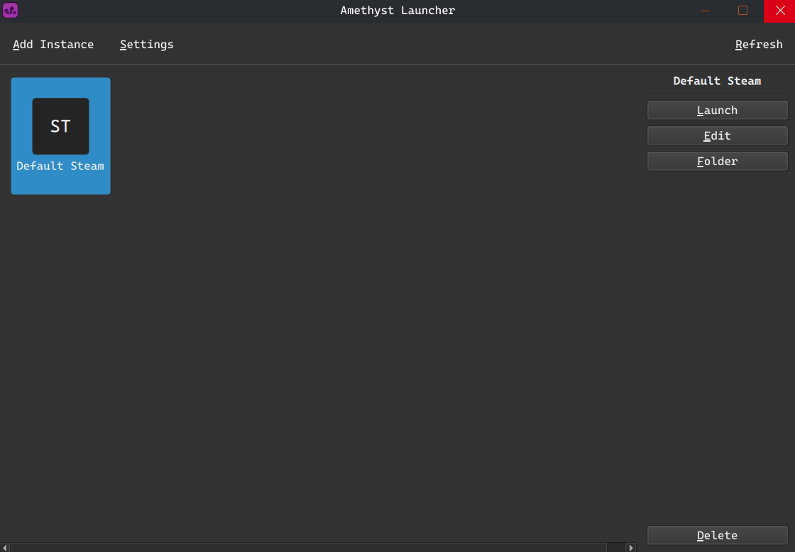

## **Amethyst Launcher** is a feature-rich launcher for Geometry Dash, currently in alpha. *Expect bugs.*

### Requires a legitimate copy of Geometry Dash and a PC.



## Features

- Geode Profiles
- Multiple Instances
- Different Versions
- And more to come...

## Commonly Asked Questions

### Why doesn't it work on mobile?
- Mobile operating systems like Android require a different language for our backend, along with a whole range of permissions that we're not able to support right now.
- iOS support is unlikely unless Apple significantly lightens its restrictions.

### Why do I need to grant permissions on Windows?
- Files inside the Program Files directory, including Steam, are protected by Windows and require admin permissions to rename folders and use symlinks.
- Symlinks on Windows are created via `mklink`, which requires elevated permissions.
- These permissions are used solely to handle installations in a safe and legal way.

### Why do I need a Steam copy?
We require a legitimate Steam copy to comply with Steam's EULA and to avoid any risk of piracy.

### I want to contribute! How do I do that?
Check out the [CONTRIBUTING.md](./CONTRIBUTING.md) file it has everything you need to get started.

## Installing

**Amethyst Launcher can only be installed from GitHub Releases.**

### Windows
Releases → Latest version → Install the `.exe`

### Debian GNU/Linux
Releases → Latest version → Run:
```bash
sudo apt install /path/to/deb.deb
```

## Building

### GNU/Linux

**Requirements:**
- Python 3
- Qt 6

#### Debian
```bash
sudo apt install python3 python3-pip python3-venv qt6-base-dev build-essential
```

#### Fedora
```bash
sudo dnf install python3 python3-pip qt6-qtbase-devel
```

#### Arch Linux
```bash
sudo pacman -S python python-pip qt6-base
```

#### Set up the environment
```bash
python3 -m venv venv
source venv/bin/activate
pip install -r requirements.txt
```

#### Build the app
```bash
pyinstaller amethyst.spec --noconfirm
```

#### Set the permissions
```bash
chmod +x dist/AmethystLauncher/AmethystLauncher
```

### Windows

**Requirements:**
- Python 3 (make sure it is added to PATH)
- Qt 6

#### Set up the environment
```powershell
python -m venv venv
.\venv\Scripts\activate
pip install -r requirements.txt
```

#### Build the app
```powershell
pyinstaller amethyst.spec --noconfirm
```

#### Run the app
```powershell
.\dist\AmethystLauncher\AmethystLauncher.exe
```
Windows will prompt for the necessary permissions via UAC.

## License

See [LICENSE](./LICENSE) for details.